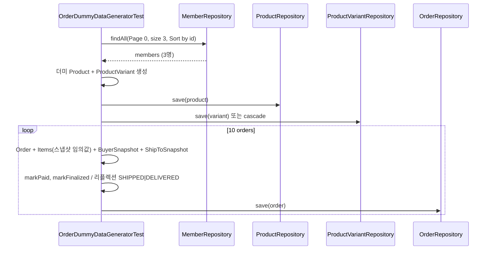

# 주문 내역 더미데이터 SpringBootTest 계획 (수정본)

## 개요

DB에 저장되는 주문 더미데이터를 생성하는 Spring Boot 테스트 클래스를 추가한다. 기존 DummyDataGeneratorTest·ProductDummyDataTest 패턴을 따르며, **상품/옵션은 테스트 내에서 최소 1개씩 생성**하고, **OrderItem 스냅샷 필드는 임의 값**으로 채운다. 결제완료/배송중/배송완료 상태의 주문 10개를 ID 기준 상위 3명 멤버에게 분배하고, order_items 및 order 스냅샷(OrderBuyerSnapshot, OrderShipToSnapshot)을 함께 생성한다.

---

## 1. 전제 조건

- **멤버**: `MemberRepository.findAll(PageRequest.of(0, 3, Sort.by("id")))`로 ID 오름차순 상위 3명 사용. 3명 미만이면 테스트에서 실패 처리 또는 명시적 예외 메시지.
- **상품/옵션**: **DB에 기존 상품을 두지 않음.** 테스트 시작 시 **같은 테스트 내에서** 최소 1개의 Product, 1개의 ProductVariant를 생성해 저장한 뒤, 모든 OrderItem이 이 product/variant를 FK로 참조하게 한다. **스냅샷 필드**(productNameSnapshot, variantSnapshot, unitPriceSnapshot)에는 **임의/랜덤 값**을 넣어 주문마다 다른 상품 정보처럼 보이게 한다.
- **저장 방식**: 기존 DummyDataGeneratorTest처럼 `@Transactional` + `@Rollback(false)`로 DB에 실제 저장.

---

## 2. 테스트 클래스 위치 및 구조

- **파일**: `backend/src/test/java/com/backend/OrderDummyDataGeneratorTest.java` (신규).
- **어노테이션**: `@SpringBootTest`, `@ActiveProfiles("test")`, `@DisplayName("주문 더미데이터 생성")`.
- **의존성 주입**: `MemberRepository`, `OrderRepository`, `ProductRepository`, `ProductVariantRepository` (또는 Product 생성 시 Member 필요 → `MemberRepository`로 생성자 멤버 조회).

---

## 3. 조건별 구현 요구사항

### 3.1 상품/옵션: 테스트 내 더미 생성 + 스냅샷은 임의 값

- **1) 더미 Product·ProductVariant 생성**
  - 테스트 메서드 상단에서 Member 1명(예: ID 오름차순 1번)으로 **Product 1개** 생성 (이름 예: "주문더미상품", description/basePrice/status 등 최소 필수만 채움).
  - 해당 Product에 **ProductVariant 1개** 생성 (optionText, price, stockQty, active 등 최소만 채움).
  - `productRepository.save(product)`, variant는 product.getVariants().add 후 cascade 또는 variantRepository.save.
- **2) OrderItem 스냅샷은 임의 값**
  - 각 OrderItem은 `product`·`variant`는 위에서 만든 **동일한 더미 엔티티**를 FK로 사용.
  - `productNameSnapshot`, `variantSnapshot`, `unitPriceSnapshot`, `qty`, `lineAmount`는 **랜덤/고정 목록에서 선택한 임의 값**으로 설정 (주문마다·아이템마다 다른 문구/가격 가능).
  - 예: 상품명 목록 `["프로틴파우더", "비타민C", "오메가3", ...]`에서 랜덤 선택, 옵션 텍스트·단가·수량도 비슷하게 임의 부여.

이렇게 하면 **기존 상품 데이터에 의존하지 않고**, **화면에 보이는 상품 정보/옵션은 전부 임의로 넣은 값**으로 통일할 수 있다.

### 3.2 상태: 결제완료(PAID), 배송중(SHIPPED), 배송완료(DELIVERED)만

- OrderStatus: `PAID`, `SHIPPED`, `DELIVERED`만 사용.
- 10개 주문에 위 3가지 상태를 골고루 배분 (예: PAID 4, SHIPPED 3, DELIVERED 3 또는 랜덤).
- **PAID**: Order를 CREATED로 생성 후 save → `markPaid(Instant.now())` → `markFinalized()` 호출.
- **SHIPPED / DELIVERED**: `markPaid`·`markFinalized` 적용 후, **테스트에서만** 리플렉션으로 `Order.status`를 SHIPPED 또는 DELIVERED로 변경하고 `orderRepository.save(order)`.

### 3.3 order_items와 order 스냅샷 생성

- **Order**: orderNo, member, status, totalPayableAmount, shippingFee 필수. 회원 주문이므로 guestPhone/guestPasswordHash는 null.
- **OrderItem**: order, product(더미), variant(더미), OrderItemStatus.ORDERED, **productNameSnapshot/variantSnapshot/unitPriceSnapshot/qty/lineAmount는 임의 값**.
- **OrderBuyerSnapshot**: order, buyerName, buyerEmail, buyerPhone (멤버 정보 또는 더미 값).
- **OrderShipToSnapshot**: order, recipientName, recipientPhone, zipcode, address1, address2 (더미/랜덤 주소).
- Order의 `addItem()`, `setBuyerSnapshot()`, `setShipToSnapshot()` 사용 후 `orderRepository.save(order)` 한 번으로 cascade 저장.

### 3.4 주문 10개, 랜덤 단어로 각각 구분

- order_no: `"ORD-DUMMY-" + 랜덤단어1 + "-" + 랜덤단어2 + "-" + 타임스탬프/UUID 일부` 등으로 유일성 보장.

### 3.5 멤버 3명, ID 낮은 순서로 배정

- `memberRepository.findAll(PageRequest.of(0, 3, Sort.by("id"))).getContent()`.
- 3명 미만이면 `IllegalStateException("주문 더미데이터 생성에는 최소 3명의 회원이 필요합니다.")` 등으로 실패.
- 10개 주문을 round-robin 등으로 3명에게 배분 (예: 1번 → 1,4,7,10 / 2번 → 2,5,8 / 3번 → 3,6,9).

---

## 4. 데이터 흐름 (요약)

---

## 5. 체크리스트 (구현 시)

| 항목 | 내용 |
|------|------|
| 멤버 3명 | ID 오름차순 상위 3명, 부족 시 실패 |
| 더미 상품/옵션 | 테스트 내에서 Product 1개 + ProductVariant 1개 생성 후 모든 OrderItem이 참조 |
| 스냅샷 임의 값 | productNameSnapshot, variantSnapshot, unitPriceSnapshot 등 주문/아이템마다 다르게 설정 가능 |
| 주문 10개 | order_no에 랜덤 단어 포함, 유일 |
| 상태 | PAID / SHIPPED / DELIVERED만, 골고루 배분 |
| 스냅샷 | OrderBuyerSnapshot, OrderShipToSnapshot 필수 생성 |
| OrderItem | 주문당 1개 이상, FK는 더미 product/variant, 스냅샷 필드는 임의 값 |
| paidAt/finalized | PAID 이상은 markPaid(Instant), markFinalized() 적용 |
| SHIPPED/DELIVERED | 리플렉션으로 status만 변경 후 save |
| 롤백 | @Rollback(false)로 DB 반영 |

---

## 6. 실행 방법 (문서화)

- 테스트 메서드에 `@Test`, `@Transactional`, `@Rollback(false)` 적용.
- 클래스 또는 메서드 `@DisplayName`으로 "주문 더미데이터 생성" 명시.
- 주석에: "회원 3명 이상만 DB에 있으면 됨. 상품/옵션은 테스트 내에서 더미 1개씩 생성하며, 주문 상품 정보(스냅샷)는 임의 값으로 채움. IDE에서 해당 테스트 실행 또는 `./gradlew test --tests \"com.backend.OrderDummyDataGeneratorTest.generateOrderDummyData\""` 안내.
